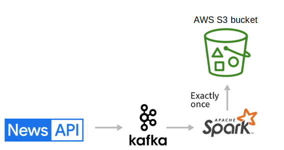
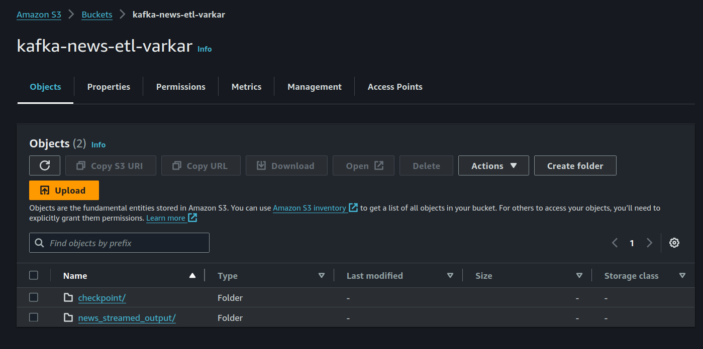

# newsAPI_kafka_spark_s3_ETL

**Architecture**:

### Processing steps:

1. Install Kafka.
    1. Run zookeeper server.
    2. Run kafka broker.
2. Create a kafka-producer to extract data using News API.
3. Create a Kafka-consumer using pyspark.
    1. Download necesary jar files in jar folder inside local spark folder. 
    2. Create a spark session using jar files.
    3. Read streamed input from kafka.
    4. Convert json data by applying new schema.
    5. Write processed data to s3 bucket.
4. Create a aws s3 sink by creating s3 bucket.
    * Create an IAM user with required permissions and download user access key.
 

**Checkout the source code in src folder.**

_Your s3 bucket should look like this:_ 

